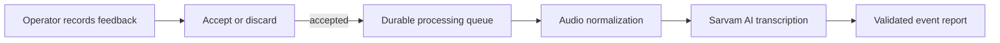

# Event Lens

Event Lens is a local operator console that turns spoken museum-visitor feedback into an evidence-based event report. An operator records each visitor's comments, keeps only the useful recordings, and receives a structured summary of what visitors said worked well or needs attention across the exhibits.

## What problem does it solve?

Collecting feedback at a live event is usually manual: someone takes notes, tries to associate comments with the right exhibit, and later turns those notes into a report. That process is slow, inconsistent, and makes it easy to lose useful feedback.

Event Lens gives an operator a fast, repeatable workflow instead:

1. Start a recording for one visitor.
2. Save the recording or discard it immediately if it is not useful.
3. Let the system normalize the audio and transcribe accepted feedback in the background.
4. End the session and generate a report that groups validated findings into **working well**, **needs attention**, and **mixed feedback**.

The report uses the museum project catalog to connect feedback to the correct exhibit. It presents findings rather than copying visitor quotations or visitor IDs into the final Markdown report.

## How it works

Event Lens runs as two local processes: a Python service controls microphone capture and processing, while a Next.js interface gives the operator a browser-based control panel. The local API listens only on `127.0.0.1`.



## Technical highlights

- **Built for live operation:** microphone capture writes audio on a dedicated thread while transcription runs separately, so the operator can move to the next visitor without waiting on the network.
- **Safe failure handling:** accepted raw WAV files are preserved, each queue item tracks its own status, and interrupted processing can recover when the application restarts.
- **Practical operator experience:** the browser dashboard provides recording state, elapsed time, input level, shortcuts, and report readiness; terminal controls are also available on Windows.
- **Structured AI output:** report responses are constrained by a JSON schema and validated against the exhibit catalog and contributing visitor IDs before a report is written.

## Quick start

### 1. Install and configure

Use Python 3.10 or later, [uv](https://docs.astral.sh/uv/), and Node.js with npm.

```powershell
uv sync --extra dev
Copy-Item .env.example .env
Set-Content .env 'SARVAM_API_KEY=replace-with-your-key'
Set-Location ui
npm ci
Set-Location ..
```

`SARVAM_API_KEY` is required even for the configuration check because the application constructs the transcription adapter before it evaluates `--check-only`.

### 2. Start the local services

In one terminal, start the microphone and reporting API:

```powershell
uv run python -m src.operator_server
```

In another terminal, start the operator interface:

```powershell
Set-Location ui
npm run dev
```

Open the local URL printed by Next.js, normally `http://localhost:3000`.

### 3. Capture feedback and create a report

Select **Start recording**, then use **Save & next** for usable feedback, **Retry** to discard the current partial recording, or **Stop capture** when the session is over. Once all accepted recordings have finished transcribing, select **Report**.

The browser interface shows the recording state, elapsed time, microphone level, and when a report can be generated.

## Documentation

- [Operate Event Lens](docs/operations.md) for capture, reporting, and troubleshooting.
- [Reference](docs/reference.md) for commands, configuration, local API, and generated data.
- [Architecture](docs/architecture.md) for the processing lifecycle and design trade-offs.

## Verification

```powershell
uv run pytest
uv run event-lens --check-only
Set-Location ui
npm run build
```

The configuration check requires a valid `SARVAM_API_KEY`. The test suite uses a fake transcription adapter and does not call Sarvam.
