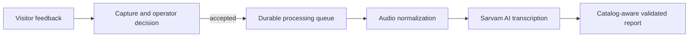

# Event Lens

Event Lens is an end-to-end museum feedback intelligence system. It captures spoken visitor feedback, protects the original recordings, processes and transcribes accepted audio, connects feedback to the right museum project, and produces an evidence-based event report.

The browser interface is only one control surface. The project itself is the full pipeline behind it: real-time audio capture, durable background processing, Sarvam AI speech-to-text, structured report generation, recovery after interruption, and a local API that connects the components.

## What problem does it solve?

Collecting feedback at a live event is usually manual: someone takes notes, tries to associate comments with the right exhibit, and later turns those notes into a report. That process is slow, inconsistent, and makes it easy to lose useful feedback.

Event Lens makes that workflow reliable from recording through analysis:

1. Start a recording for one visitor.
2. Save the recording or discard it immediately if it is not useful.
3. Let the system normalize the audio and transcribe accepted feedback in the background.
4. End the session and generate a report that groups validated findings into **working well**, **needs attention**, and **mixed feedback**.

The report uses the museum project catalog to connect feedback to the correct exhibit. It presents findings rather than copying visitor quotations or visitor IDs into the final Markdown report.

## What the project includes

- **Controlled feedback capture:** records one visitor at a time, lets the operator accept or discard the current recording, and preserves accepted audio as the source record.
- **Durable processing pipeline:** puts accepted recordings into a persisted FIFO queue, normalizes them into mono 16 kHz WAV files, records audio-quality metadata, and resumes recoverable work after an interruption.
- **Adaptive transcription:** uses Sarvam AI's direct transcription path for clips up to 30 seconds and its batch-job path for longer recordings.
- **Evidence-based reporting:** sends completed, unreported transcripts and the museum catalog to the report model, validates the schema and exhibit references it returns, then creates Markdown and JSON reports with an audit manifest.
- **Operational controls:** exposes the pipeline through a local HTTP API, a browser dashboard, and Windows terminal shortcuts. These are ways to operate the system, not the system's main purpose.

## How it works

The Python application owns the capture, queue, processing, transcription, storage, and report stages. A local HTTP API exposes their current state and actions. The Next.js application is a thin operator client that calls that API; it does not capture audio or produce reports itself. The API listens only on `127.0.0.1`.



## Technical highlights

- **Real-time capture separated from AI work:** microphone capture writes audio on a dedicated thread while normalization, transcription, and reporting run outside the callback path.
- **Recoverable and auditable data flow:** accepted raw WAV files are never modified by the worker; queue state, quality metadata, transcripts, model responses, reports, and the report manifest are stored separately.
- **Right-sized transcription strategy:** short recordings use direct transcription, while longer feedback automatically switches to a Sarvam batch job.
- **Guardrails around AI output:** report responses are constrained by a JSON schema and validated against the exhibit catalog and contributing visitor IDs before a report is written.

## Quick start

### 1. Install and configure

Use Python 3.10 or later, [uv](https://docs.astral.sh/uv/), and Node.js with npm.

```powershell
uv sync --extra dev
Copy-Item .env.example .env
Set-Content .env 'SARVAM_API_KEY=replace-with-your-key'
Set-Location ui
npm ci
Set-Location ..
```

`SARVAM_API_KEY` is required even for the configuration check because the application constructs the transcription adapter before it evaluates `--check-only`.

### 2. Start the local services

In one terminal, start the microphone and reporting API:

```powershell
uv run python -m src.operator_server
```

In another terminal, start the operator interface:

```powershell
Set-Location ui
npm run dev
```

Open the local URL printed by Next.js, normally `http://localhost:3000`.

### 3. Capture feedback and create a report

Select **Start recording**, then use **Save & next** for usable feedback, **Retry** to discard the current partial recording, or **Stop capture** when the session is over. Once all accepted recordings have finished transcribing, select **Report**.

The browser interface shows the recording state, elapsed time, microphone level, and when a report can be generated.

## Documentation

- [Operate Event Lens](docs/operations.md) for capture, reporting, and troubleshooting.
- [Reference](docs/reference.md) for commands, configuration, local API, and generated data.
- [Architecture](docs/architecture.md) for the processing lifecycle and design trade-offs.

## Verification

```powershell
uv run pytest
uv run event-lens --check-only
Set-Location ui
npm run build
```

The configuration check requires a valid `SARVAM_API_KEY`. The test suite uses a fake transcription adapter and does not call Sarvam.
