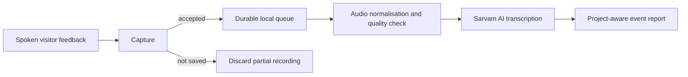

# Event Lens

Event Lens turns spoken feedback from a live event into structured, evidence-based findings about the projects visitors discuss. It manages the full path from a visitor's voice to a usable event report: capture, secure local storage, audio processing, transcription, project-aware analysis, and report generation.

It is designed for exhibitions, demonstrations, showcases, and other multi-project events. The browser console is only a local control surface for the operator; the product itself is the complete feedback-processing workflow behind it.

## The problem

Useful feedback is easy to lose during a live event. Notes are incomplete, recordings are difficult to organise, and turning dozens of comments into a fair summary takes time. It is also easy to confuse feedback about one project with another.

Event Lens provides a simple workflow for collecting feedback without losing the technical traceability behind the final report.

## From feedback to findings

1. **Capture:** records one visitor response at a time through a local microphone. The operator can save it, retry it, pause, or end collection.
2. **Preserve and process:** stores accepted raw audio locally, then normalises and checks it in the background.
3. **Transcribe:** sends valid recordings to Sarvam AI and stores the resulting transcript with its audio record.
4. **Analyse:** gives completed transcripts and a project catalog to the report model so it can identify supported findings for the projects visitors actually discussed.
5. **Report:** produces validated Markdown and JSON reports grouped into **working well**, **needs attention**, and **mixed feedback**.

The final report does not expose raw visitor quotations or visitor identifiers. It focuses on practical findings supported by the collected feedback.

## How it works



This is one application, not a frontend feature with a separate backend product. Python runs the capture, storage, processing, transcription, and reporting workflow. The Next.js browser interface is intentionally thin: it only gives the operator a simple way to control and observe that local workflow.

## Why the design matters

Event Lens separates real-time recording from slower AI work. Once a recording is saved, the operator can move to the next visitor while transcription continues in the background.

- **Durable by default:** accepted WAV files and queue state are stored locally before transcription begins.
- **Recoverable after interruption:** on restart, pending work is discovered and resumed without retranscribing completed feedback.
- **Controlled AI output:** the report model receives transcripts plus project context, must return JSON matching a schema, and is checked against known project and visitor IDs before a report is written.
- **Simple local operation:** a browser console controls the workflow through an API bound only to `127.0.0.1`, so microphone actions are not exposed to the network.

## Technology

- **Feedback pipeline:** Python 3.10+, `sounddevice`, `soundfile`, and NumPy for capture and audio processing
- **AI processing:** Sarvam AI Saaras v3 for speech-to-text and `sarvam-105b` for structured event reporting
- **Reliable local records:** WAV and JSON files for source audio, processing state, transcripts, and reports
- **Operator controls:** Next.js and TypeScript for the local browser console

## Run it locally

### 1. Install dependencies

```powershell
uv sync --extra dev
Copy-Item .env.example .env
# Add your SARVAM_API_KEY to .env
Set-Location ui
npm ci
Set-Location ..
```

### 2. Start the services

In the first terminal, start the local capture and reporting service:

```powershell
uv run python -m src.operator_server
```

In a second terminal, start the browser console:

```powershell
Set-Location ui
npm run dev
```

Open the local URL printed by Next.js, usually `http://localhost:3000`.

### 3. Collect feedback and create a report

1. Select **Start recording**.
2. Select **Save & next** for useful feedback, **Save & pause** between visitors, or **Retry** to discard the current recording.
3. Select **Stop capture** when feedback collection is finished.
4. Wait for accepted recordings to finish transcribing, then select **Report**.

The latest report is stored at `data/reports/event_feedback_report.md`.

## What this project demonstrates

Event Lens is more than a transcription demo. It demonstrates how to build a reliable local AI workflow around a real operational problem:

- real-time audio capture without blocking on network calls;
- durable background work and recovery after an interrupted process;
- provider-backed transcription for English, Tamil, and code-mixed speech;
- constrained LLM output with schema and evidence validation; and
- a thin local control interface for operating the workflow.

## Documentation

- [Operator guide](docs/operations.md): run the system during an event.
- [Architecture](docs/architecture.md): understand the processing and recovery design.
- [Reference](docs/reference.md): commands, configuration, API routes, and stored data.

## Verification

```powershell
uv run pytest
uv run event-lens --check-only
Set-Location ui
npm run build
```

The test suite uses a fake transcription adapter and does not send requests to Sarvam AI.
