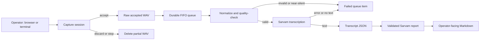

# How Event Lens protects feedback from capture to report

Event Lens separates real-time recording from slower transcription and reporting so an operator can move immediately to the next visitor without risking an accepted recording.

## The problem

Microphone input arrives on a timing-sensitive callback. Network transcription and report generation are slower and can fail. Combining those jobs would either block capture or make one failure discard unrelated feedback.

## The approach

The PortAudio callback only copies a block into a bounded queue. A dedicated writer thread owns the WAV handle, and accept, discard, and stop wait for that thread to close the file before renaming or deleting it. This prevents a race between a control action and an open audio file.

Accepted recordings enter a single sequential worker. The worker creates separate normalized and quality outputs, then transcribes only valid normalized audio. It marks a single item failed on an exception and continues with later items. Raw accepted WAV files remain intact even after a normalization or transcription failure.

The report stage reads only completed, non-empty transcripts that were not listed in a prior report manifest. It sends those transcripts and the museum project catalog to Sarvam with a JSON schema, validates the returned project IDs, outcomes, and supporting visitor IDs, then produces a Markdown report without raw quotations or visitor IDs.

## Recovery behavior

The queue persists to one JSON file by atomically replacing a temporary file. On startup, Event Lens reconciles that state with the filesystem:

- A queue record with a transcript is treated as completed.
- A pending, normalizing, or transcribing item with a raw WAV returns to pending.
- A non-failed item without its raw WAV becomes failed.
- Raw visitor WAV files missing from the persisted queue are discovered and queued or marked completed based on their transcript.

This makes an interrupted event recoverable without retranscribing already completed recordings.

## Trade-offs

- The processor is deliberately single-threaded and FIFO. It provides predictable ordering and limits concurrent provider work, at the cost of throughput for large backlogs.
- Resampling uses linear interpolation. It keeps the dependency surface small for short feedback clips, rather than pursuing studio-grade resampling.
- The browser has no direct microphone access. It receives level and state from the Python service, so one capture implementation serves both terminal and browser operators.
- The service binds to loopback. This protects microphone controls from remote access, but the browser console must run on the same machine unless the deployment is intentionally redesigned.
