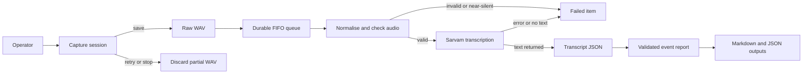

# Architecture

Event Lens is a local feedback pipeline. Its design goal is simple: saving one visitor's feedback must never stop the system from being ready for the next visitor.

## Processing flow

## Responsibilities

| Component | Responsibility |
| --- | --- |
| Python application | Owns microphone capture, files, queue state, processing, transcription, and reports. |
| Browser console | A thin local control surface that displays status and sends operator actions to the Python application. |
| Sarvam speech-to-text | Converts a valid audio recording into text. |
| Sarvam report model | Creates project findings from transcripts and the supplied project catalog. |
| Local storage | Keeps source audio, derived files, queue state, transcripts, provider responses, reports, and the report manifest. |

## Reliability decisions

### Recording is separate from AI work

Audio callbacks are timing-sensitive. Network transcription and report generation are slower and may fail. Event Lens therefore writes recording blocks through a dedicated writer and processes accepted recordings through a separate sequential worker.

The operator can save a recording and begin the next one while the worker processes the earlier file.

### Accepted feedback is recoverable

An accepted recording is first stored as a raw WAV and added to `queue.json`. Queue updates use an atomic file replacement. When the service restarts, Event Lens reconciles the queue with the files on disk:

- a valid transcript marks its recording as completed;
- pending or interrupted work with a raw WAV returns to pending;
- a non-failed item without its raw WAV becomes failed; and
- orphaned visitor WAV files are discovered and added to the queue.

This keeps completed transcripts from being sent again while allowing interrupted work to continue.

### Reports are evidence constrained

The report model receives only completed, non-empty transcripts plus the project catalog. Its response must match a JSON schema. Before Event Lens writes a report, it checks that every referenced project exists in the catalog and every supporting visitor ID came from the submitted transcript set.

The final Markdown report contains findings, not raw transcripts or visitor identifiers.

## Deliberate trade-offs

- Processing is single-threaded and FIFO. This keeps ordering predictable and limits concurrent provider requests; a very large backlog will take longer to clear.
- The browser does not use its own microphone API. The Python service is the single capture implementation for both browser and terminal operation.
- The API binds to loopback only. This is safer for a machine controlling a microphone, but the browser console must run on that same machine.
